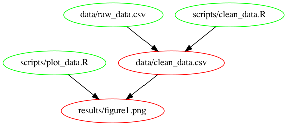
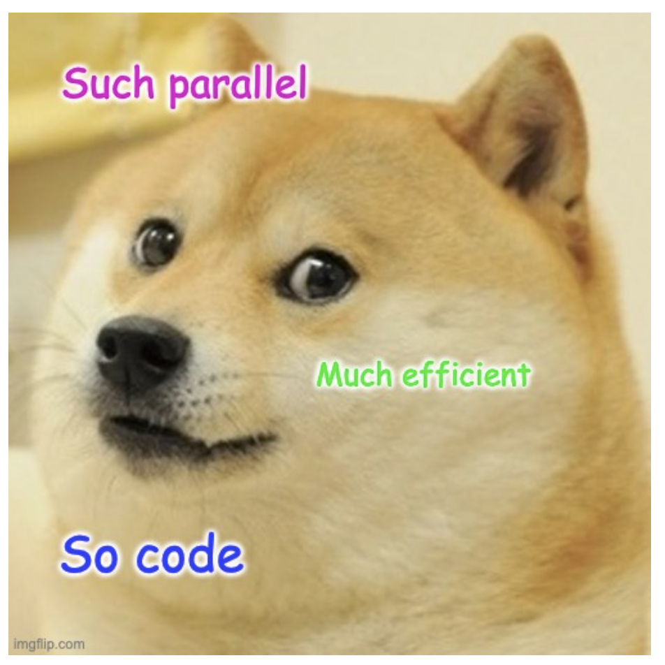
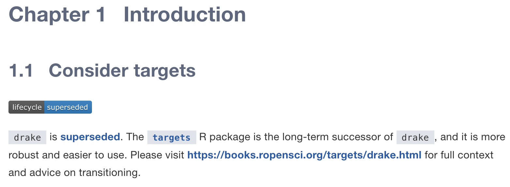
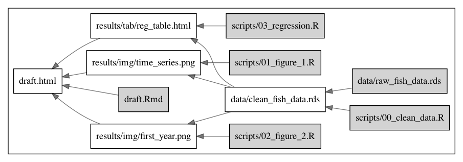

```{r setup, include=FALSE}
knitr::opts_chunk$set(echo = TRUE,
                      fig.align="center")
```

# TOC

- Motivation: the problem
- Common solutions
- GNU Make
- Work together

## Disclaimer

>- This is not the solution to all [coding] problems
>- It is just another tool in your DataScience toolbox (albeit, a useful one!)

## Motivation: the problem

>- Coding is rarely linear
>- We often have to go back and change data, assumptions, transformations, filters, colors, font types
>- Projects can get really big really fast... and re-running an huge Rmd file is not an option
>- We rarely work alone (new data, new approaches, new questions...)

## Motivation: an example

We'll simulate everyone's nightmare:

>- You have built your "coding pipeline" and are ready to share results
>- Then, you (or a colleague) finds an error in the raw data (crisis!!!)
>- You fix the error, and now have to rerun the ENTIRE analysis. Chaos:
  >- _which script did what, again?_
  >- _What depended on what?_

>- Yes, organization solves a lot of this (but who's got time for that?)

# [Self-]Motivation:

> ~~The solution lies in the problem~~

> The problem lies in the solution to the original problem

# {data-background="motivation.png"}

## Consider a case

```{bash, eval = F}
data
    |_raw_data.csv
    |_clean_data.csv
scripts
    |_clean_data.R
    |_plot_data.R
results
    |_figure1.png
```

```{r, echo = F, out.width="50%", fig.align="center"}

```

## A potential solution: `lapply`

```{r, eval = F}
# Identify all scripts
scripts <- list.files(path = "scripts",
                      pattern = "*.R")

# Run them all
lapply(scripts, source)
```


## A potential solution: `purrr` + `furrr`

```{r, eval = F}
# Identify all scripts
scripts <- list.files(path = "scripts",
                      pattern = "*.R")

# Run them all... in parallel
plan(multisession, workers = 4) # Use four cores
future_walk(scripts, source)    # Walk through files
```

```{r, out.width="35%", echo = F, fig.align="center"}

```

## A potential solution: `run_all.R`

Have a script:

```{r, eval = F}
# Run all scripts
# This script runs all the code in my project, from scratch
source("scripts/clean_data.R")      # To clean the data
source("scripts/plot_data.R")       # To plot the data
```

And either call `source(run_all.R)` or manually source the ones that we *think* we need to run.

## Problems with these

- Do I even need to actually run all?

- What if variables / values are left in my environment?

- It worked when I wrote it, but not anymore

- What if the timing isn't correct?

## Existing solutions

### Many R packages

>- [drake](https://books.ropensci.org/drake/)

>- [targets](https://docs.ropensci.org/targets/)

>- Many, many, many other great solutions...

## Existing solutions

### But some shortcommings

>- R-specific (hinders collaboration)
>- Things keep changing (for better, but still)

## Existing solutions

### But some shortcommings

- R-specific (hinders collaboration)
- Things keep changing (for better, but still)

```{r, echo = F}

```

>- They really are just leveraging an existing infrastructure

# Enter `make`

## Overview of `make` and `Makefile`

From [`GNU`'s website](https://www.gnu.org/software/make/):

>"GNU Make is a **tool** which **controls the generation** of executables and other non-source files of a program from the program's **source files.**"

## How does it work?

>- `make` "looks" for a file called `Makefile`
- You write that `Makefile`, listing all the good stuff
- What's _"the good stuff"_?

## The good stuff:

>- _Targets_: What needs to be created
- _Prerequisites_: The dependencies
- _Commands_: How do we go from dependency to target?
- Together, these make a _rule_
- We specify them as:

## Three things to keep in mind:

- _Targets_: What needs to be created
- _Prerequisites_: The dependencies
- _Commands_: How do we go from dependency to target?
- Together, these make a _rule_
- We specify them as:

```{bash, eval = F}
target: prerequisite
  command
```

>- Note on notation, indentation...

## A lame example

```{bash, eval = F}
taco: recipe fridge/tortilla fridge/meat fridge/salsa
  follow recipe
  
happiness: taco           #A target can be a prerequisite
  eat taco
```


# Short example

## Remember our previous case?

```{bash, eval = F}
data
    |_raw_data.csv
    |_clean_data.csv
scripts
    |_clean_data.R
    |_plot_data.R
results
    |_figure1.png
```


```{r, echo = F, out.width="50%", fig.align="center"}

```

## What's the `Makefile` for this project?

### Recall:

```{bash, eval = F}
target: prerequisites
  command
```

### So, then:

```{bash, eval = F}
results/figure1.png: scripts/plot_data.R data/clean_data.csv
  Rscript scripts/plot_data.R

data/clean_data.csv: scripts/clean_data.R data/raw_data.csv
  Rscript scripts/clean_data.R
```

And one command does it all: `make`

# Cool things

## Making it into a graph

For this, we need [graphviz](https://www.graphviz.org/) and [makefile2graph](https://github.com/lindenb/makefile2graph.git)

```{bash, eval = F}
make -Bnd | make2graph | dot -Tpng -o makefile-dag.png
```

>- `-Bnd` tells `make` to "`B`: Unconditionally make all targets, `n`: just print, `d`: print debug info"
- `|` is just the OG pipe
- `-Tpng` tells `dot` "`T` use the following output format: `png`"

## Making it into a graph

```{bash, eval = F}
make -Bnd | make2graph | dot -Tpng -o makefile-dag.png
```

```{r, echo = F, out.width="100%"}

```


## Automatic variables

- `$@`: the file name of the target
- `$<`: the name of the first prerequisite
- `$^`: the names of all prerequisites
- `$(@D)`: the directory part of the target
- `$(@F)`: the file part of the target
- `$(<D)`: the directory part of the first prerequisite
- `$(<F)`: the file part of the first prerequisite

## Automatic variables

### Let's use two: `$(<D)` and `$(<F)`

```{bash, eval = F}
results/figure1.png: scripts/plot_data.R data/clean_data.csv
  Rscript scripts/plot_data.R
```

Can be written as

```{bash, eval = F}
results/figure1.png: scripts/plot_data.R data/clean_data.csv
  cd $(<D);Rscript $(<F)
```

## Pattern rules

Imagine you have something like this:

```{bash, eval = F}
results/figure1.png: scripts/figure1.R
  Rscript scripts/figure1.R

results/figure2.png: scripts/figure2.R
  Rscript scripts/figure2.R

results/figure3.png: scripts/figure3.R
  Rscript scripts/figure3.R

results/figure4.png: scripts/figure4.R
  Rscript scripts/figure4.R

results/figure5.png: scripts/figure5.R
  Rscript scripts/figure5.R
.
.
.
.
.
.
```

## Pattern rules

Writing out this chunk $n$ times presents opportunity for $\alpha n$ errors:

```{bash, eval = F}
results/figure1.png: scripts/figure1.R
  cd $(<D);Rscript $(<F)
```

Instead, we use pattern rules with `%`, which is equivalent to `*`

```{bash, eval = F}
results/%.png: scripts/%.R
    cd $(<D);Rscript $(<F)
```

(I think it's cool that the workflow induces standardization)

## Environmental variables

You can include them:

```{bash, eval = F}
R_OPTS=--no-save --no-restore --no-init-file --no-site-file

results/%.png: scripts/%.R
    cd $(<D);Rscript $(R_OPTS) $(<F)
```


# Hands-on

```{r, out.width="90%", fig.align="center", echo = F}

```

The repo is here: [https://github.com/jcvdav/make_tutorial](https://github.com/jcvdav/make_tutorial)

## Today's project

```{bash, eval = F}
draft.Rmd
draft.html
scripts
  |_00_clean_data.R
  |_01_figure_1.R
  |_02_figure_2.R
  |_03_regression.R
results
  |_img
  |  |_ first_year.png
  |  |_ time_sereies.png
  |_tab
     |_ reg_table.html
```


## Today's project

>- `make` the project
- Simulate getting a "fixed" version of the data and re-`make`ing the project _(end-to-end update)_
- Simulate making one change _(partial update)_
- Simulate getting NEW (or more?) data and re-`make`int the project once again _(end-to-end update)_
- Finally, create you own code and add a pair of target / prerequisites _(partial update)_
- If we have time, we'll generalize some of the code (less typing!)
- If we have time, we'll automate the generation of the workflow image

## Other resources

- [Miles McBain "That feeling of workflowing" video lecture](https://youtu.be/jU1Zv21GvT4)
- [There is an `R` in `R`eproducibility](https://towardsdatascience.com/there-is-an-r-in-reproducibility-b9120712742f)
- [Great example from simple to complex with GNU](https://kbroman.org/minimal_make/)
- [GNU Make documentation](https://www.gnu.org/software/make/)
- [Cool short example of makefile2graph and graphviz](https://gist.github.com/carlislerainey/9a1e49cb195076165a4f07a683ce05a7)


